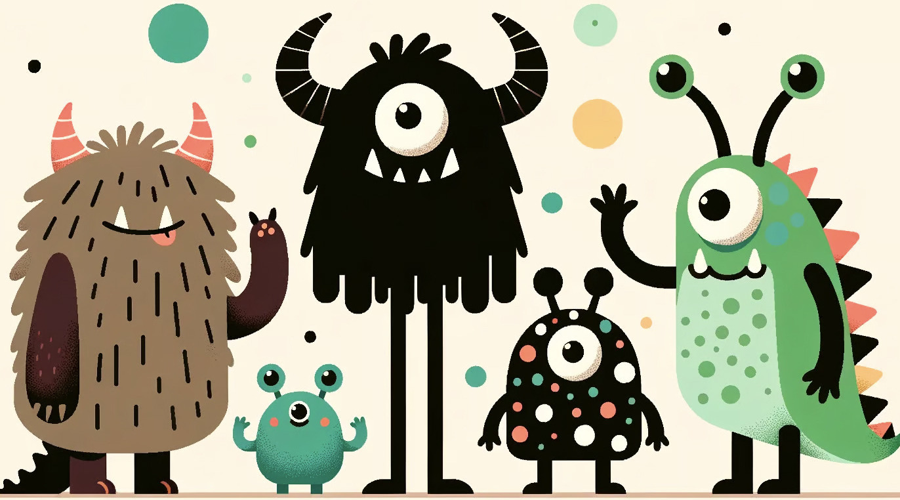

# Mora: More like Sora for Generalist Video Generation
> 🔍 See our newest Video Generation paper: [**"Mora: Enabling Generalist Video Generation via A Multi-Agent Framework"**](https://github.com/lichao-sun/Mora) [](https://github.com/lichao-sun/Mora) [)](https://github.com/lichao-sun/Mora)
> 
> 📧 Please let us know if you find a mistake or have any suggestions by e-mail: lis221@lehigh.edu

## 📰News

🚀️ Mar 19: Our paper "Mora: Enabling Generalist Video Generation via A Multi-Agent Framework" is released!

## What is Mora
Mora is a multi-agent framework designed to facilitate generalist video generation tasks, leveraging a collaborative approach with multiple visual agents. It aims to replicate and extend the capabilities of OpenAI's Sora.

## 🎥Demo (1024×576 resolution, 12 seconds and more!)
<p align="left">
  
  
  
  
</p>

## Mora: A Multi-Agent Framework for Video Generation

- **Multi-Agent Collaboration**: Utilizes several advanced visual AI agents, each specializing in different aspects of the video generation process, to achieve high-quality outcomes across various tasks.
- **Broad Spectrum of Tasks**: Capable of performing text-to-video generation, text-conditional image-to-video generation, extending generated videos, video-to-video editing, connecting videos, and simulating digital worlds, thereby covering an extensive range of video generation applications.
- **Open-Source and Extendable**: Mora’s open-source nature fosters innovation and collaboration within the community, allowing for continuous improvement and customization.
- **Proven Performance**: Experimental results demonstrate Mora's ability to achieve performance that is close to that of Sora in various tasks, making it a compelling open-source alternative for the video generation domain.


## Results

### Text-to-video generation
<table class="left">
<tr>
  <th align="left"><b>Input prompt</b></th>
  <th align="left"><b>Output video</b></th>
</tr>
<tr>
  <td>A vibrant coral reef teeming with life under the crystal-clear blue ocean, with colorful fish swimming among the coral, rays of sunlight filtering through the water, and a gentle current moving the sea plants. </td>
  <td></td>
</tr>
<tr>
  <td>A majestic mountain range covered in snow, with the peaks touching the clouds and a crystal-clear lake at its base, reflecting the mountains and the sky, creating a breathtaking natural mirror.</td>
  <td></td>
</tr>
  <tr>
  <td>In the middle of a vast desert, a golden desert city appears on the horizon, its architecture a blend of ancient Egyptian and futuristic elements.The city is surrounded by a radiant energy barrier, while in the air, seve</td>
  <td></td>
</tr>
</table>

### Text-conditional image-to-video generation
<table class="left">
<tr>
  <th align="left"><b>Input prompt</b></th>
  <th align="left"><b>Input image</b></th>
  <th align="left"><b>Mora generated Video</b></th>
  <th align="left"><b>Sora generated Video</b></th>
</tr>
<tr>
  <td>Monster Illustration in flat design style of a diverse family of monsters. The group includes a furry brown monster, a sleek black monster with antennas, a spotted green monster, and a tiny polka-dotted monster, all interacting in a playful environment. </td>
  <td></td>
  <td></td>
  <td></td>
</tr>
<tr>
  <td>An image of a realistic cloud that spells “SORA”.</td>
  <td></td>
  <td></td>
  <td></td>
</tr>
</table>

### Extend generated video

<table class="left">
<tr>
  <th align="left"><b>Original video</b></th>
  <th align="left"><b>Mora extended video</b></th>
  <th align="left"><b>Sora extended video</b></th>
</tr>
<tr>
  <td></td>
  <td></td>
  <td></td>
</tr>
</table>

### Video-to-video editing

<table class="left">
<tr>
  <th align="left"><b>Instruction</b></th>
  <th align="left"><b>Original video</b></th>
  <th align="left"><b>Mora edited Video</b></th>
  <th align="left"><b>Sora edited Video</b></th>
</tr>
<tr>
  <td>Change the setting to the 1920s with an old school car. make sure to keep the red color.</td>
  <td></td>
  <td></td>
  <td></td>
</tr>
<tr>
  <td>Put the video in space with a rainbow road</td>
  <td></td>
  <td></td>
  <td></td>
</tr>
</table>

### Connect Video

<table class="left">
<tr>
  <th align="left"><b>Input previous video</b></th>
  <th align="left"><b>Input next video</b></th>
  <th align="left"><b>Output connect Video</b></th>
</tr>
<tr>
  <td></td>
  <td></td>
  <td></td>
</tr>
<tr>
  <td></td>
  <td></td>
  <td></td>
</tr>
</table>

### Simulate digital worlds

<table class="left">
<tr>
  <th align="left"><b>Mora simulating video</b></th>
  <th align="left"><b>Sora simulating video</b></th>
</tr>
<tr>
  <td></td>
  <td></td>
</tr>
<tr>
  <td></td>
  <td></td>
</tr>
</table>

## Getting Started
* [ ] Coming soon
## Citation
```
@article{liu2024sora,
  title={Sora: A Review on Background, Technology, Limitations, and Opportunities of Large Vision Models},
  author={Liu, Yixin and Zhang, Kai and Li, Yuan and Yan, Zhiling and Gao, Chujie and Chen, Ruoxi and Yuan, Zhengqing and Huang, Yue and Sun, Hanchi and Gao, Jianfeng and others},
  journal={arXiv preprint arXiv:2402.17177},
  year={2024}
}
```
```
@misc{openai2024sorareport,
  title={Video generation models as world simulators},
  author={OpenAI},
  year={2024},
  howpublished={https://openai.com/research/video-generation-models-as-world-simulators},
}
```

